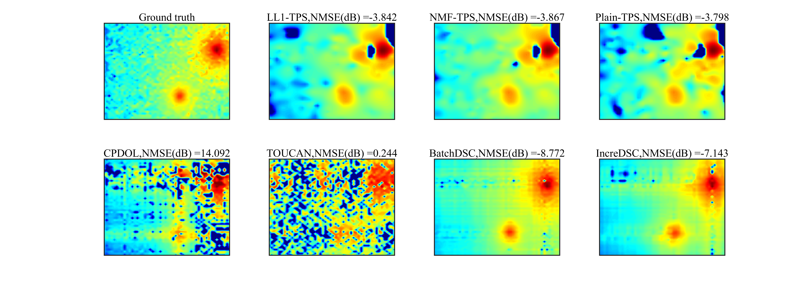

# dynamic_spectrum_cartography
This repository includes codes for proposed approaches and all the baselines of paper 10.1109/TSP.2025.3531872: Dynamic Spectrum Cartography: Reconstructing Spatial-Spectral-Temporal Radio Frequency Map via Tensor Completion.

Get started by simply running **Dynamic_SC.m**. This will return a visualization result together with reconstruction errors, under a ray-tracing scenario.



To reproduce more results, please download dataset 'Param_R8_sigma8_K64_T600_v0.1.mat' at https://drive.google.com/file/d/1Yi_7MrMLGWe_1Br9JQPOXhnVivjY62jE/view?usp=sharing, 
and 'Param_R8_sigma8_K64_T600_v0.01.mat' at https://drive.google.com/file/d/1hxxoUhHVFKmSZKtIRBWlkoeCxOtfJIYR/view?usp=sharing.

Also try to customize a scenario using the files in **Dynamic_SC_Customize**, where a radio map generator is offered. 

Directory **Dynamic_SC_LongTerm** offers the codes of the proposed IncreDSC algorithm under long-term scenario, where the activated emitters change over time. To reproduce the result, download dataset
'Param_sigma8_K64_T600_v0.1_LT.mat' at https://drive.google.com/file/d/12Vz3Nr3PsZJUZxUsqbQw68pgxXWK05yJ/view?usp=sharing.


If you find these codes useful for your research, please consider citing
```bibtex
@article{chen2025dynamic,
  title={Dynamic Spectrum Cartography: Reconstructing Spatial-Spectral-Temporal Radio Frequency Map via Tensor Completion},
  author={Chen, Xiaonan and Wang, Jun and Huang, Qingyang},
  journal={IEEE Transactions on Signal Processing},
  year={2025},
  publisher={IEEE}
}

